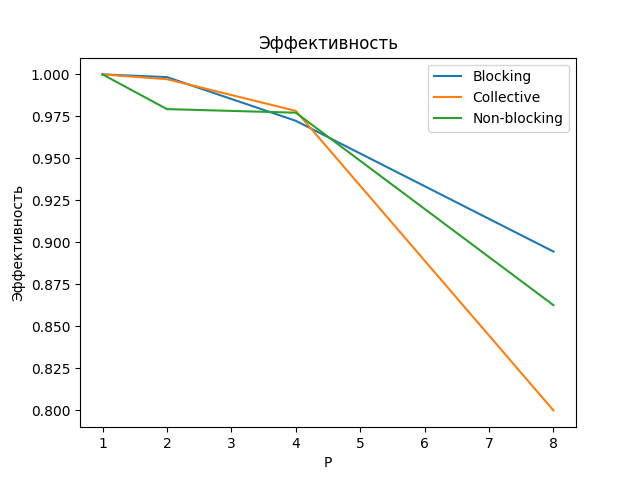
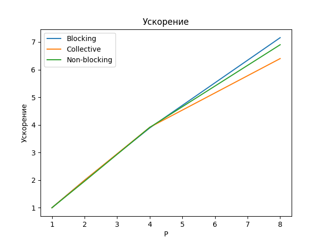
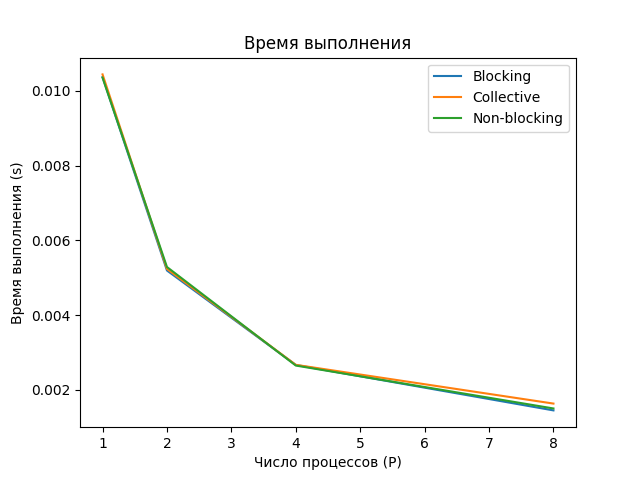
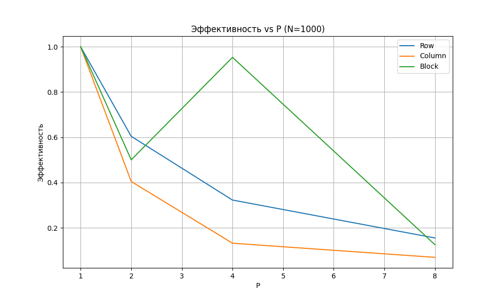
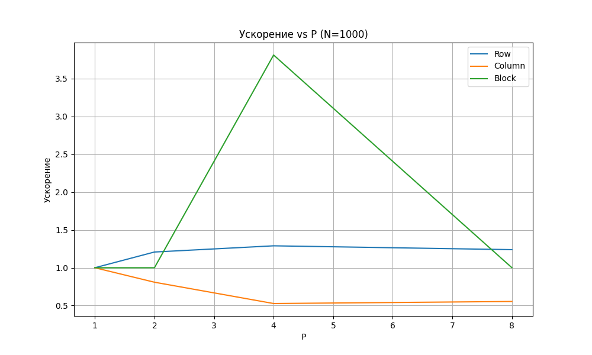
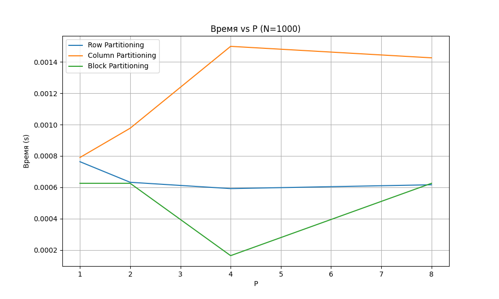

# MPI_LAB

## TASK1
### Компиляция
blocking
```bash
mpicc -o blocking main1.c
```
collective(reduce)
```bash
mpicc -o collective main2.c
```
blocking
```bash
mpicc -o nonblocking main3.c
```
### Запуск
blocking
```bash
mpirun -np 4 ./blocking
```
collective(reduce)
```bash
mpirun -np 4 ./collective
```
blocking
```bash
mpirun -np 4 ./nonblocking
```
### Графики



## TASK2
### Компиляция
ROW
```bash
mpicc -O3 main1.c -o matvec_row_mpi
```
COLUMN
```bash
mpicc -O3 main2.c -o matvec_column_mpi
```
BLOCK
```bash
mpicc -O3 main3.c -o matvec_block_mpi -lm
```
### Запуск
ROW
```bash
mpirun -np 4 ./matvec_row_mpi 1000
```
COLUMN
```bash
mpirun -np 4 ./matvec_column_mpi 1000
```
BLOCK
```bash
mpirun -np 4 ./matvec_block_mpi 1000
```
### Графики



